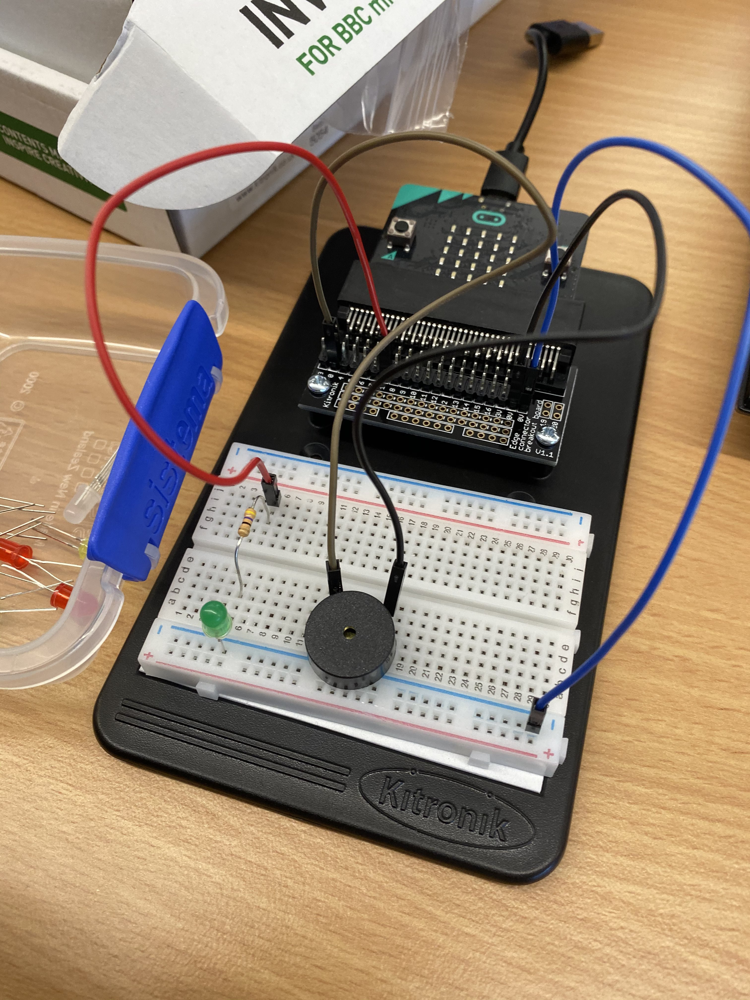

# Inventor Kit Experiments

*Markdown reference: https://guides.github.com/features/mastering-markdown/*

## Instructions ##

*For a selection of 5 inventor kit experiments that you choose, fill out the following sections.

### Experiment name ###

LED Flash and Beep

#### Photo of completed project ####
*In the code below, replace `missingimage.png` with the name of the image, which should be in the `kitexperiments` folder.*

This experiment consisted of creating from scratch a LED that began on start up to be on for 3 seconds before flashing every second after. The experiment also wanted to produce a sound every time the LED was turned off. 

#### Reflection ####
In this experiment, something new to me was having to complete the micro-bit code and required wires onto the breadboard without following instructions. This meant that I could finally discover the purpose of where and why a mother-father wire is connected between the breadboard and edge connector breakout board. I was unable to truly discover the meaning behind this before as I rushed through the tutorial book's experiments without putting much thought into why these wires and parts were going where they were as I just followed the given instructions. 

This experiment could be the basis of a real world application such as the pedestrian crossing around Australia. Obviously, its not the same as the experiment, but the pedestrian crossing is an improved upon verison of this experiment. For example, when the LED person is red a low sounding beep occurs in intervals of at least 2 seconds. Then when that LED turns green, a higher pitch beeping sound pounds one after another, signaling it is safe to cross the road. 

### Experiment name ###

(Replace this with the experiment name)

#### Photo of completed project ####
In the code below, replace imagemissing.jpg with the name of the image, which should be in the kitexperiments folder.

(Insert a caption here)

#### Reflection ####

In this experiment, something new to me was or something I learned was (insert something here).

This experiment could be the basis of a real world application such as (insert something here).

### Experiment name ###

(Replace this with the experiment name)

#### Photo of completed project ####
In the code below, replace imagemissing.jpg with the name of the image, which should be in the kitexperiments folder.

(Insert a caption here)

#### Reflection ####

In this experiment, something new to me was or something I learned was (insert something here).

This experiment could be the basis of a real world application such as (insert something here).

### Experiment name ###

(Replace this with the experiment name)

#### Photo of completed project ####
In the code below, replace imagemissing.jpg with the name of the image, which should be in the kitexperiments folder.

(Insert a caption here)

#### Reflection ####

In this experiment, something new to me was or something I learned was (insert something here).

This experiment could be the basis of a real world application such as (insert something here).

### Experiment name ###

(Replace this with the experiment name)

#### Photo of completed project ####
In the code below, replace imagemissing.jpg with the name of the image, which should be in the kitexperiments folder.

(Insert a caption here)

#### Reflection ####

In this experiment, something new to me was or something I learned was (insert something here).

This experiment could be the basis of a real world application such as (insert something here).

