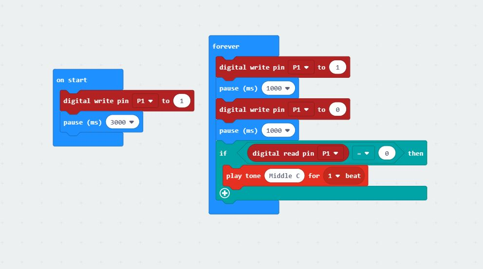
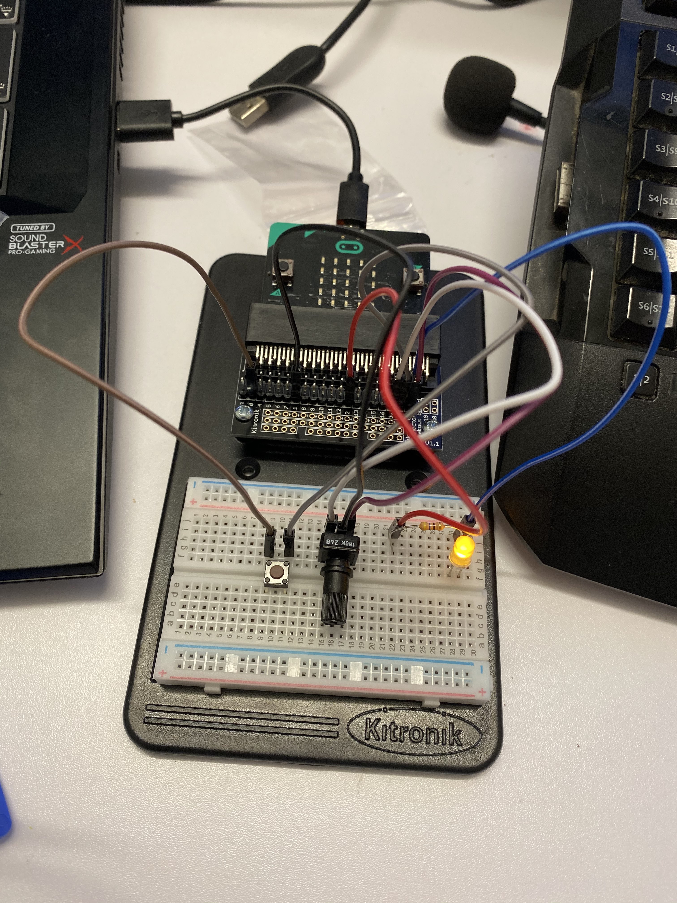
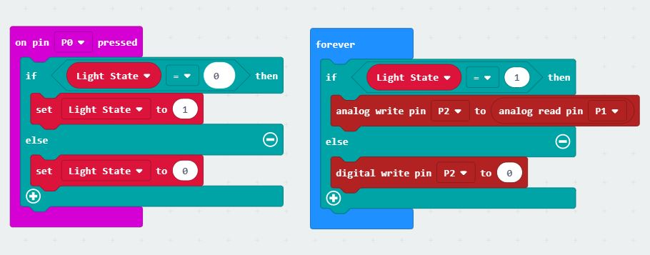
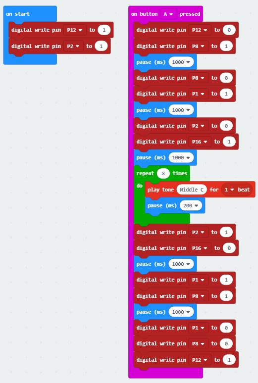
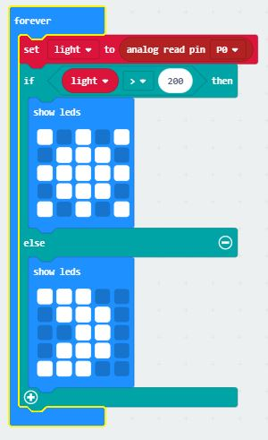

# Inventor Kit Experiments

*Markdown reference: https://guides.github.com/features/mastering-markdown/*

### LED Flash and Beep ###

This experiment consisted of creating from scratch a LED that began on start up to be on for 3 seconds before flashing every second after. The experiment also wanted to produce a sound every time the LED was turned off. 

#### Reflection ####
In this experiment, something new to me was having to complete the micro-bit code and required wires onto the breadboard without following instructions. This meant that I could finally discover the purpose of where and why a mother-father wire is connected between the breadboard and edge connector breakout board. I was unable to truly discover the meaning behind this before as I rushed through the tutorial book's experiments without putting much thought into why these wires and parts were going where they were as I just followed the given instructions. 

This experiment could be the basis of a real world application such as the pedestrian crossing around Australia. Obviously, its not the same as the experiment, but the pedestrian crossing is an improved upon verison of this experiment. For example, when the LED person is red a low sounding beep occurs in intervals of at least 2 seconds. Then when that LED turns green, a higher pitch beeping sound pounds one after another, signaling it is safe to cross the road. 

### Dimming an LED using a Potentiometer ###

The experiment determines whether or not a LED needs to have power based on if a user has pushed the button connected to the micro-bit. From there, the user can adjust the brightness of this LED by turning the potentiometer to be bright or dimmer. At the end, the button can also turn the power to the LED off. 

#### Reflection ####
In this experiment, a push switch and potentiometer were used for the first time since obtaining the micro-bit kit and these parts purpose were learnt. I also learnt through this experiment what the difference between an 'analog write pin' and 'digital write pin' is through following the instructions. I also did further testing by trying out both pins to see if the difference actually mattered. As a result of this, it turned out that it did matter, because when the 'digital write pin' replaced the 'analog write pin' nothing happened when the button was pressed. This also led to researching why and it was discovered that an analog write ranges from 0 to 255, whereas a digital write is only either high or low. 

This experiment could be the basis of a real world application such as a dimmer light that are inbuilt into houses. The mechanics work similiarly, just that the experiment made with the micro-bit is a mini verison of the application built into houses. This dimmer light in the real world as an application sees a user choose to turn the light switch on and can adjust the voltage sent to the inbuilt light. This voltage would be sent through the wires in the wall to reach the light.

### Making a Pedestrian Crossing ###

The above experiment was made by following the extra tutorial that created the mechanics of a traffic intersection and pedestrian crossing. The user is required to press button A on the mirco-bit to initalate the traffic to stop and let the pedestrian cross. When the pedestrian light is green, the buzzer produces sound to let the pedstrian to go. When the timer for the pedestrian crossing finishes, the traffic lights go through red, red and orange, to green where traffic resumes until button A is pressed again.

#### Reflection ####
In this experiment, the timer feature within the micro-bit was discovered and used to build a realistic experience of a pedestrian crossing. This timer may of consisted of 'Pause' for however long, but before this experiment it was not known to exist. At the same time, 100ms does not equal 1 second. This measure of time was learnted when testing the program on the mirco-bit with the wires and parts attached. Instead, it was learnt that 1 second actually equals to 1000ms, thus slowing down the process of the LED's to produce the correct line. For if this was an actual pedestrian crossing, the traffic would not have any notice to stop. Another thing used within this experiment that was new to me was the repeating 'loop'. Although, I have seen the option of a 'loop' before, I had yet to use it until this experiment. As a result of implementing this function into the micro-bit code, reduced the amount of code added into the coding space. 

As this experiment is based off a real life pedestrian crossing but scaled down to be able to be produced on a micro-bit, it is difficult to discover yet another verison of real world application that this might be similar to. But a similar application could be an elevator. When a user clicks the button, the elevator works to arrive at its destination and open its doors. However, if a button is not pressed, the elevator could either sit where it was last used or rest at the ground floor. But during this entire time, the doors remain closed, that is until a button is pressed. 

### Using a Light Sensor and Analaog Inputs ###

For this experiment, a phototransistor reacts to the light surrounding the micro-bit and changes the LED screen to show either a moon or sun symbol. This light is gathered by the phototransistor, who then sends information to the micro-bit how much has been detected. From there, if this light is greater than 200, a sun symbol appears, else a moon is displayed. 

#### Reflection ####
In this experiment, I learnt to triple check my code that I input into the mirco-bit. This lesson was learnt as a result of the micro-bit not changing symbols from moon to the sun. It still did not change even when I shined a flashlight at the phototransistor. This led to believing that the part I connected might not of even been the phototransistor. Because initially I had placed the wrong part on the breadboard before figuring out it might not of been the correct. However, even when this was discovered the LED display was still yet to change. This experiment was then left for weeks before retrying to attempt to get it to work. When I went to look at the code from the previous attempt, it was discovered that the array I used was 'List' instead of 'Light'. It took multiple weeks to discover a mistake in the code, hence learning to accurately check over the code before importing the code into the micro-bit. During this experiment, it was also the first time using such a part as the phototransistor, which became clear by not even knowing if I was using the correct one. 

This experiment could be the basis of a real world application such as a solar lights. These solar lights charge from the sun during the day time and determine when it is night time to turn the lights on. So when the sun does rise, these lights turn off again to recharge and await the moon to rise again. 

### Experiment name ###

(Replace this with the experiment name)

#### Photo of completed project ####
In the code below, replace imagemissing.jpg with the name of the image, which should be in the kitexperiments folder.

(Insert a caption here)

#### Reflection ####

In this experiment, something new to me was or something I learned was (insert something here).

This experiment could be the basis of a real world application such as (insert something here).

