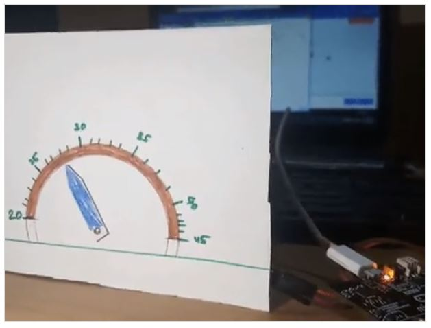
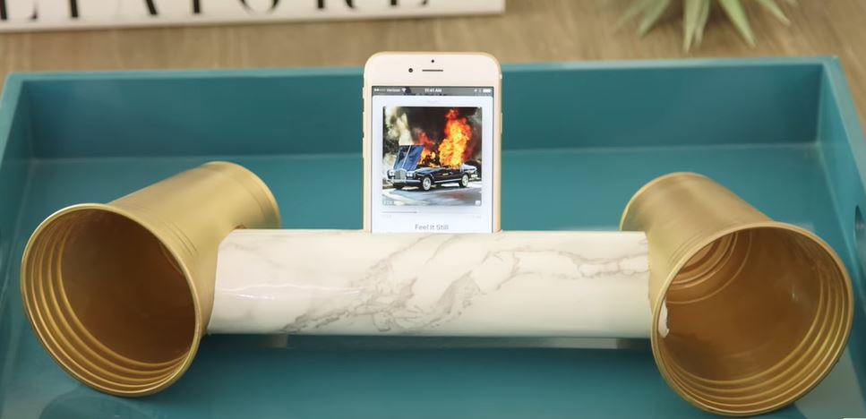
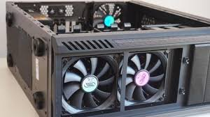

# Assessment 1: Replication project
*Markdown reference:* [https://guides.github.com/features/mastering-markdown/](http://guides.github.com/features/mastering-markdown/)

## Temperature Gauge ##

## Related projects ##
*Find about 6 related projects to the project you choose. A project might be related through  function, technology, materials, fabrication, concept, or code. Don't forget to place an image of the related project in the* `replicationproject` *folder and insert the filename in the appropriate places below. Copy the markdown block of code below for each project you are showing, updating the number* `1` *in the subtitle for each.*

### Related project 1 ###
Temperature Gauge with a Number Range 

https://www.hackster.io/anish78/how-to-create-temperature-gauge-using-micro-bit-a601cc

This project is related to mine because the code is similar. It is similar because this code obtains the surrounding temperature and moves the servo's horns in the direction of where it's temperature is on the number range. This code will be implemented into the replication project to also obtain the surrounding the temperature, from there the servo will also move between cold, average and hot on a temperature range. Therefore, this project is related to mine because it will use similar code, and provides an output to the user on the temperature. 

### Related project 2 ###
DIY Speaker

https://www.youtube.com/watch?v=_p1MRfNmz9o

This project is related to mine because I will end up combining the cups and cupboard roll into my project to make the beeping sound of the alarm louder. As a result of this, the beep sound should be loud enough for a user to hear and take action. In the end, this project is related to mine as it is the best result of my surrounding materials to create a 'Do It Yourself' loud speaker. 

### Related project 3 ###
Cooling Fan within a Computer to stop Overheating

https://www.techwalla.com/articles/what-is-the-fan-function-in-a-computer

This project is related to mine through its concept of starting the fan or deciding to shut the computer down when it overheats to save it's components. It is related to my replication project by concept as my project detects if the temperature is deemed harzardous, lights will flash and sound will beep in warning. If after the user does not move to react to this warning, the beeping will get faster before it stops and only the flashing lights remain. This is similar to the cooling fan within a computer as the fan determines if the computer's CPU needs cooling down, if so it will happen. However, if it is unable to cool and the heat is overwhelming, the fan and computer decided to shut the computer down in an effect to cool the computer down. 

### Related project 4 ###
Geodesic Duct-Tape Dome

https://www.youtube.com/watch?v=53UAMGpN3UU

This project is related to mine because of its fabrication choice of using duct tape to construction a much larger project such as a dome. It is related to my replication project as it inspired the use of sticky tape to combine all the materials together. In doing so, the tape should keep everything stuck together and keep it compact. In this related project, the use of duct tape was used to connect one bamboo stick to another bamboo stick. While in the replication of the temperature gauge will see the sticky tape connect the breadboard to the roof of the tissue box, the cardboard roll securely to the tissue box and the cold to hot range on the front of the box.

### Related project 5 ###
(Insert name of project)

(Insert URL to project)

This project is related to mine because (insert)

### Related project 6 ###
(Insert name of project)

(Insert URL to project)

This project is related to mine because (insert)

## Reading reflections ##
*Reflective reading is an important part of actually making your reading worthwhile. Don't just read the words to understand what they say: read to see how the ideas in the text fit with and potentially change your existing knowledge and maybe even conceptual frameworks. We assume you can basically figure out what the readings mean, but the more important process is to understand how that changes what you think, particularly in the context of your project.*

*For each of the assigned readings, answer the questions below.*

### Reading: Don Norman, The Design of Everyday Things, Chapter 1 (The Psychopathology of Everyday Things) ###

*What I thought before: Describe something that you thought or believed before you read the source that was challenged by the reading.*

*What I learned: Describe what you now know or believe as a result of the reading. Don't just describe the reading: write about what changed in YOUR knowledge.*

*What I would like to know more about: Describe or write a question about something that you would be interested in knowing more about.*

*How this relates to the project I am working on: Describe the connection between the ideas in the reading and one of your current projects or how ideas in the reading could be used to improve your project.*

### Reading: Chapter 1 of Dan Saffer, Microinteractions: Designing with Details, Chapter 1 ###

*What I thought before: Describe something that you thought or believed before you read the source that was challenged by the reading.*

*What I learned: Describe what you now know or believe as a result of the reading. Don't just describe the reading: write about what changed in YOUR knowledge.*

*What I would like to know more about: Describe or write a question about something that you would be interested in knowing more about.*

*How this relates to the project I am working on: Describe the connection between the ideas in the reading and one of your current projects or how ideas in the reading could be used to improve your project.*

### Reading: Scott Sullivan, Prototyping Interactive Objects ###

*What I thought before: Describe something that you thought or believed before you read the source that was challenged by the reading.*

*What I learned: Describe what you now know or believe as a result of the reading. Don't just describe the reading: write about what changed in YOUR knowledge.*

*What I would like to know more about: Describe or write a question about something that you would be interested in knowing more about.*

*How this relates to the project I am working on: Describe the connection between the ideas in the reading and one of your current projects or how ideas in the reading could be used to improve your project.*

## Interaction flowchart ##
*Draw a flowchart of the interaction process in your project. Make sure you think about all the stages of interaction step-by-step. Also make sure that you consider actions a user might take that aren't what you intend in an ideal use case. Insert an image of it below. It might just be a photo of a hand-drawn sketch, not a carefully drawn digital diagram. It just needs to be legible.*

## Process documentation

*In this section, include text and images that represent the development of your project including sources you've found (URLs and written references), choices you've made, sketches you've done, iterations completed, materials you've investigated, and code samples. Use the markdown reference for help in formatting the material.*

*This should have quite a lot of information!*

*There will likely by a dozen or so images of the project under construction. The images should help explain why you've made the choices you've made as well as what you have done. Use the code below to include images, and copy it for each image, updating the information for each.*

*Include screenshots of the code you have used.*

## Project outcome ##

*Complete the following information.*

### Project title ###

### Project description ###

*In a few sentences, describe what the project is and does, who it is for, and a typical use case.*

### Showcase image ###

*Try to capture the image as if it were in a portfolio, sales material, or project proposal. The project isn't likely to be something that finished, but practice making images that capture the project in that style.*

### Additional view ###

*Provide some other image that gives a viewer a different perspective on the project such as more about how it functions, the project in use, or something else.*

### Reflection ###

*Describe the parts of your project you felt were most successful and the parts that could have done with improvement, whether in terms of outcome, process, or understanding.*

*What techniques, approaches, skills, or information did you find useful from other sources (such as the related projects you identified earlier)?*

*What ideas have you read, heard, or seen that informed your thinking on this project? (Provide references.)*

*What might be an interesting extension of this project? In what other contexts might this project be used?*
