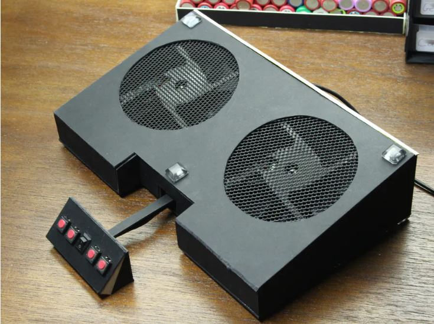
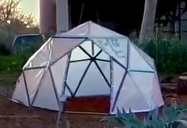
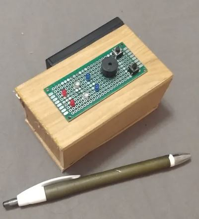
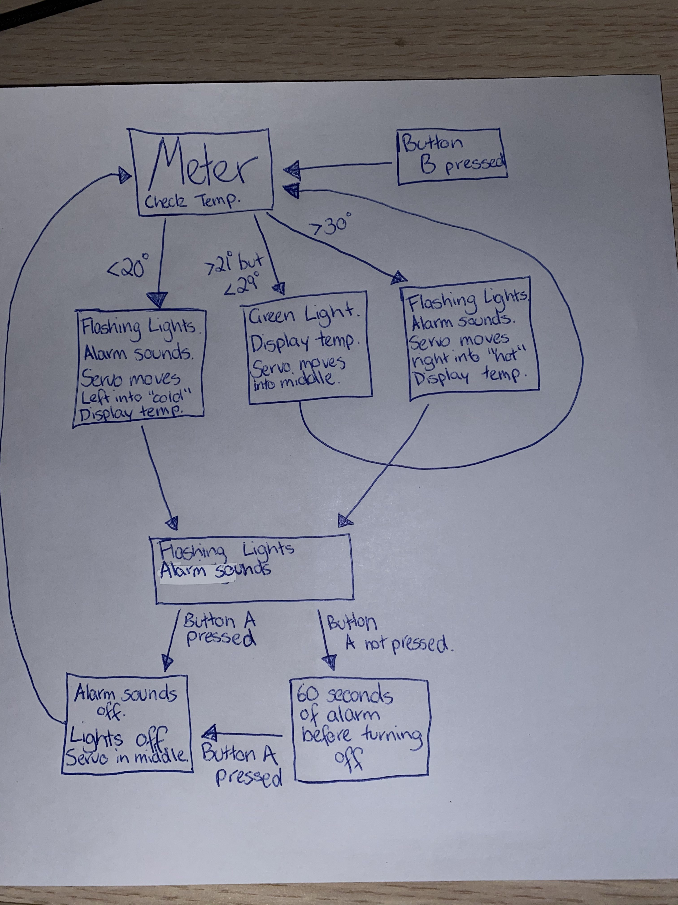

# Assessment 1: Replication project
*Markdown reference:* [https://guides.github.com/features/mastering-markdown/](http://guides.github.com/features/mastering-markdown/)

## Temperature Gauge ##

## Related projects ##

### Related project 1 ###
Temperature Gauge with a Number Range 

https://www.hackster.io/anish78/how-to-create-temperature-gauge-using-micro-bit-a601cc

This project is related to mine because the code is similar. It is similar because this code obtains the surrounding temperature and moves the servo's horns in the direction of where it's temperature is on the number range. This code will be implemented into the replication project to also obtain the surrounding the temperature, from there the servo will also move between cold, average and hot on a temperature range. Therefore, this project is related to mine because it will use similar code, and provides an output to the user on the temperature. 

### Related project 2 ###
DIY Speaker

https://www.youtube.com/watch?v=_p1MRfNmz9o

This project is related to mine because I will end up combining the cups and cupboard roll into my project to make the beeping sound of the alarm louder. As a result of this, the beep sound should be loud enough for a user to hear and take action. In the end, this project is related to mine as it is the best result of my surrounding materials to create a 'Do It Yourself' loud speaker. 

### Related project 3 ###
Arduino Cooling Pad

https://create.arduino.cc/projecthub/BuildItDR/arduino-cooling-pad-83335b?ref=search&ref_id=fan%20cooling%20down&offset=0

This project is related to mine through its concept of starting the fan to cool down the CPU in a laptop to save the components from overheating. It is related to my replication project by concept by detecting the room temperature and deciding if the lights need to flash and alarm needs to go off for the user to do something about the temperature being too cold or too hot. Whereas, the Cooling Pad sets in motion to quickly cool the laptop down by the click of a button. 

### Related project 4 ###
Geodesic Duct-Tape Dome

https://www.youtube.com/watch?v=53UAMGpN3UU

This project is related to mine because of its fabrication choice of using duct tape to construction a much larger project such as a dome. It is related to my replication project as it inspired the use of sticky tape to combine all the materials together. In doing so, the tape should keep everything stuck together and keep it compact. In this related project, the use of duct tape was used to connect one bamboo stick to another bamboo stick. While in the replication of the temperature gauge will see the sticky tape connect the breadboard to the roof of the tissue box, the cardboard roll securely to the tissue box and the cold to hot range on the front of the box.

### Related project 5 ###
USA National Anthem with Lights & Tone

https://create.arduino.cc/projecthub/Ryaebi/us-national-anthem-with-lights-tone-3ae554?ref=search&ref_id=LED%20flashing&offset=12

This project is related to mine because of its similarities in functions to my replication project. In this USA project, it uses flashing lights to produce an image of the USA flag. At the same time, as these lights light up, the tone of the USA National Anthem plays along side. This function of the USA project is related to my replication project as when the temperature drops or raises above the acceptable temperature threshold, red and yellow lights flash back and forth while a tone of alarm happens. These lights and alarm will stop when the user acknowledges the warning from the project. 

### Related project 6 ###
$10 Portable Arduino Weather Station

https://create.arduino.cc/projecthub/GeekRex/10-portable-arduino-weather-station-aws-ccf41f?ref=search&ref_id=temp.%20technology&offset=14

This project is related to mine through the technology it uses to gather the temperature and displays it. In this project, a DHT-22 Humidity and Temperature Sensor is used to gather the room temperature that is then displayed on a LCD screen. The fact that the project uses a component to obtain the temperature, makes it related to my replication project. In my project, a temperature sensor is inbuilt into the micro-bit and will need room to obtain the temperature. At the same time, when this is obtained, it will then be displayed on the LED screen of the micro-bit. The fact that the temperature is being displayed is also related to the Weather Station, as they have a separate LCD screen to display the humidity, temperature, pressure and altitude. 

## Reading reflections ##
*Reflective reading is an important part of actually making your reading worthwhile. Don't just read the words to understand what they say: read to see how the ideas in the text fit with and potentially change your existing knowledge and maybe even conceptual frameworks. We assume you can basically figure out what the readings mean, but the more important process is to understand how that changes what you think, particularly in the context of your project.*

*For each of the assigned readings, answer the questions below.*

### Reading: Don Norman, The Design of Everyday Things, Chapter 1 (The Psychopathology of Everyday Things) ###
Before Don Norman's, The Design of Everyday Things, was read it was believed that designers created their machines based on their purpose to build the machine. As in, it was believed that a designer might of designed an airplane to get from one place to another. However, this belief was challenged as the designers need to put forth their ideas on human needs, capabilites and behaviours and how to accomodate to these. Hence designers instead focus on what errors people can make when controlling or within an airplane, such as spill water, they designer needs to accomodate this my using waterproof material. This reading also challenged this belief by describing the processes that designers go through to reach the final product. These processes consisted of human-centred design, its set of procedures and its areas of focus: industrial design, interaction design and experience design.   

As a result of reading this reading, I now know the extensive length of designing that goes into producing a successful project or machine. I also now know that the blame of a machine failure goes directly to the person who made or operated it to for their "failure to understand the machine". Which is not their fault, as machines lack the experience, common sense and leeway to understand the way they are programmed to do and to do things a specifc way. That is unless the programmer has designed the code step by step, planning for the mistakes of the machine and overly designing the machine to work and operate in different atmospheres.

Although, after the completion of this reading, I am curious to know more about how J. J.Gibson come to his conclusion of how people come to conclusions from "direct perception"  and how it works in regards to the more complicated machinery being built nowadays. From this reading, I would also like to know more about how designers created their work before the human-centred design was implemented. But more closely towards if they still developed similar patterns to the current list of procedures without knowing they were doing this. 

This reading relates to the replication project of the temperature gauge by ensuring I know the potential human needs, capabilities and behaviours that one might have in regards to my project. While these might be known, I can then develop my project by accomodating for possibile errors a user might make with the project and to user proof the machine to not fall apart. The ideas in the reading will also help to identify the affordances that a temperature gauge can provide, while also leaving signifiers on the box on how to use the machine. This will allow an easier experience of using the project, thus creating an acceptable conceptual model where there will be "major clues of how to operate through percieved structure".

### Reading: Chapter 1 of Dan Saffer, Microinteractions: Designing with Details, Chapter 1 ###
Before reading Dan Saffer's Microinteractions: Designing with Details, I always believed that what is described as microinteractions were carefully constructed features of a device. This was of course challenged by the reading by going in detail about the difference between  a feature and microinteraction. Before reading Dan Saffer's work, I believed that designers created their product and then added the intended features of that product, such as a ringer for a phone, after the completion of the product. However, this was proven correct in his work by stating that the products were made and that, what was found to be microinteractions instead of features, were an added thought after the inital product was finished. 

It was also learnt through this reading that every microinteraction begins with a trigger. Such a trigger could even include just clicking on an application such as emails and leading the microinteraction to display this information. Another trigger could even see that pushing a letter on a keyboard leads to a microinteraction of inputing the letter into the machine to display. Another interesting piece of knowledge discovered from the reading saw that microinteractions are ever growing to keep up with the advanced development of technology. While at the same time, designers are put in a position to come up with lightweight and reduced complexity microinteractions to implement into their machines or technology. 

After the completion of this reading, I would like to know more in depth about what "loops and modes" are in regards to the structure of microinteractions beyond 'meta rules'. This is because just reading 'meta rules' was unclear as to how microinteractions are controlled by this part. 

This piece of reading relates to the project that I am working on by providing information to clearly describe the microinteractions that will occur. For example, majority of the microinteractions within my project are system-initated. These are system-initated to discover the temperature before giving out the feedback through displaying on the LED screen or producing a warning through lights and sound. These rules that occur within consist of if the warning alarm and lights are flashing, the lights will remain flashing until the user presses a button on the micro-bit. These buttons will also act as a trigger for a microinteraction, because if button B is clicked, it will set off the code to discover the temperature in that room. 

### Reading: Scott Sullivan, Prototyping Interactive Objects ###

*What I thought before: Describe something that you thought or believed before you read the source that was challenged by the reading.*

*What I learned: Describe what you now know or believe as a result of the reading. Don't just describe the reading: write about what changed in YOUR knowledge.*

*What I would like to know more about: Describe or write a question about something that you would be interested in knowing more about.*

*How this relates to the project I am working on: Describe the connection between the ideas in the reading and one of your current projects or how ideas in the reading could be used to improve your project.*

## Interaction flowchart ##

## Process documentation

*In this section, include text and images that represent the development of your project including sources you've found (URLs and written references), choices you've made, sketches you've done, iterations completed, materials you've investigated, and code samples. Use the markdown reference for help in formatting the material.*

*This should have quite a lot of information!*

*There will likely by a dozen or so images of the project under construction. The images should help explain why you've made the choices you've made as well as what you have done. Use the code below to include images, and copy it for each image, updating the information for each.*

*Include screenshots of the code you have used.*

## Project outcome ##

*Complete the following information.*

### Project title ###

### Project description ###

*In a few sentences, describe what the project is and does, who it is for, and a typical use case.*

### Showcase image ###

*Try to capture the image as if it were in a portfolio, sales material, or project proposal. The project isn't likely to be something that finished, but practice making images that capture the project in that style.*

### Additional view ###

*Provide some other image that gives a viewer a different perspective on the project such as more about how it functions, the project in use, or something else.*

### Reflection ###

*Describe the parts of your project you felt were most successful and the parts that could have done with improvement, whether in terms of outcome, process, or understanding.*

*What techniques, approaches, skills, or information did you find useful from other sources (such as the related projects you identified earlier)?*

*What ideas have you read, heard, or seen that informed your thinking on this project? (Provide references.)*

*What might be an interesting extension of this project? In what other contexts might this project be used?*
