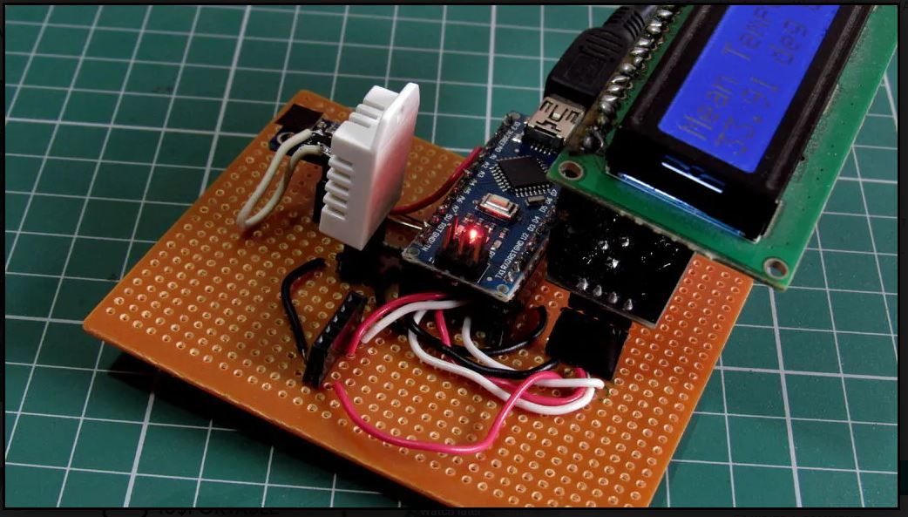
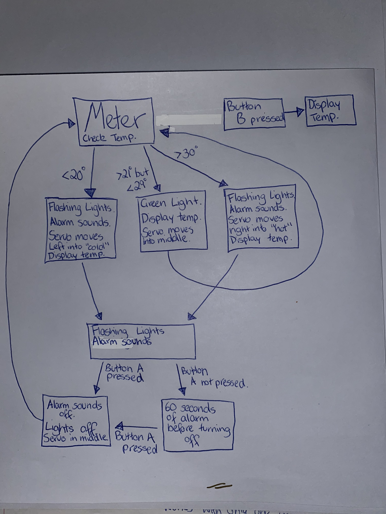

# Assessment 1: Replication project

## Temperature Gauge ##

## Related projects ##

### Related project 1 ###
Temperature Gauge with a Number Range 

https://www.hackster.io/anish78/how-to-create-temperature-gauge-using-micro-bit-a601cc

This project is related to mine because the code is similar. It is similar because this code obtains the surrounding temperature and moves the servo's horns in the direction of where it's temperature is on the number range. This code will be implemented into the replication project to also obtain the surrounding the temperature, from there the servo will also move between cold, average and hot on a temperature range. Therefore, this project is related to mine because it will use similar code, and provides an output to the user on the temperature. 

### Related project 2 ###
DIY Speaker

https://www.youtube.com/watch?v=_p1MRfNmz9o

This project is related to mine because I will end up combining the cups and cupboard roll into my project to make the beeping sound of the alarm louder. As a result of this, the beep sound should be loud enough for a user to hear and take action. In the end, this project is related to mine as it is the best result of my surrounding materials to create a 'Do It Yourself' loud speaker. 

### Related project 3 ###
Arduino Cooling Pad

https://create.arduino.cc/projecthub/BuildItDR/arduino-cooling-pad-83335b?ref=search&ref_id=fan%20cooling%20down&offset=0

This project is related to mine through its concept of starting the fan to cool down the CPU in a laptop to save the components from overheating. It is related to my replication project by concept by detecting the room temperature and deciding if the lights need to flash and alarm needs to go off for the user to do something about the temperature being too cold or too hot. Whereas, the Cooling Pad sets in motion to quickly cool the laptop down by the click of a button. 

### Related project 4 ###
Geodesic Duct-Tape Dome

https://www.youtube.com/watch?v=53UAMGpN3UU

This project is related to mine because of its fabrication choice of using duct tape to construction a much larger project such as a dome. It is related to my replication project as it inspired the use of sticky tape to combine all the materials together. In doing so, the tape should keep everything stuck together and keep it compact. In this related project, the use of duct tape was used to connect one bamboo stick to another bamboo stick. While in the replication of the temperature gauge will see the sticky tape connect the breadboard to the roof of the tissue box, the cardboard roll securely to the tissue box and the cold to hot range on the front of the box.

### Related project 5 ###
USA National Anthem with Lights & Tone

https://create.arduino.cc/projecthub/Ryaebi/us-national-anthem-with-lights-tone-3ae554?ref=search&ref_id=LED%20flashing&offset=12

This project is related to mine because of its similarities in functions to my replication project. In this USA project, it uses flashing lights to produce an image of the USA flag. At the same time, as these lights light up, the tone of the USA National Anthem plays along side. This function of the USA project is related to my replication project as when the temperature drops or raises above the acceptable temperature threshold, red and yellow lights flash back and forth while a tone of alarm happens. These lights and alarm will stop when the user acknowledges the warning from the project. 

### Related project 6 ###
$10 Portable Arduino Weather Station

https://create.arduino.cc/projecthub/GeekRex/10-portable-arduino-weather-station-aws-ccf41f?ref=search&ref_id=temp.%20technology&offset=14

This project is related to mine through the technology it uses to gather the temperature and displays it. In this project, a DHT-22 Humidity and Temperature Sensor is used to gather the room temperature that is then displayed on a LCD screen. The fact that the project uses a component to obtain the temperature, makes it related to my replication project. In my project, a temperature sensor is inbuilt into the micro-bit and will need room to obtain the temperature. At the same time, when this is obtained, it will then be displayed on the LED screen of the micro-bit. The fact that the temperature is being displayed is also related to the Weather Station, as they have a separate LCD screen to display the humidity, temperature, pressure and altitude. 

## Reading reflections ##

### Reading: Don Norman, The Design of Everyday Things, Chapter 1 (The Psychopathology of Everyday Things) ###
Before Don Norman's, The Design of Everyday Things, was read it was believed that the label on doors such as 'pull' or 'push' were just known as labels. But according to this reading, they are known more importantly as "Signifers" which "communicate purpose, structure and operation to user". Also, the belief behind feedback was challenged as I didn't know there could be something considered as 'too much' for feedback. It is mentioned within the reading that a lot of feedback is similar to a "back-seat driver" which is annoying and frustrating. But when there is too much feedback from the product it can be distracting to the user or annoying that it leads to the user to ignore and disable. 

As a result of reading this reading, I now know the extensive length of designing that goes into producing a successful project or machine. These information also leads to knowing that both cognition and emotion must keep mind of these and implement someway into their designs to give the user a successful experience. Before reading Don Norman's work, the concept of 'Affordances' of a product was never know. It was never known that an object gives leeway to another underlying task. For example, a ball affords movement and bounce. 

Although, after the completion of this reading, I am curious to know more about how J. J.Gibson come to his conclusion of how people come to conclusions from "direct perception"  and how it works in regards to the more complicated machinery being built nowadays. From this reading, I would also like to know if previous designers used a similar process to the affordances, signifiers, mapping, feedback and conceptual models process to create a project. With this knowledge, I would like to know if they were implementing any of the listed already before it was labelled as such procedures.  

This reading relates to the replication project of the temperature gauge by ensuring I know the potential human needs, capabilities and behaviours that one might have in regards to my project. While these might be known, I can then develop my project by accomodating for possibile errors a user might make with the project and to user proof the machine to not fall apart. The ideas in the reading will also help to identify the affordances that a temperature gauge can provide, while also leaving signifiers on the box on how to use the machine. This will allow an easier experience of using the project, thus creating an acceptable conceptual model where there will be "major clues of how to operate through percieved structure".

### Reading: Chapter 1 of Dan Saffer, Microinteractions: Designing with Details, Chapter 1 ###
Before reading Dan Saffer's Microinteractions: Designing with Details, I always believed that what is described as microinteractions were carefully constructed features of a device. This was of course challenged by the reading by going in detail about the difference between  a feature and microinteraction. Before reading Dan Saffer's work, I believed that designers created their product and then added the intended features of that product, such as a ringer for a phone, after the completion of the product. However, this was proven correct in his work by stating that the products were made and that, what was found to be microinteractions instead of features, were an added thought after the inital product was finished. 

It was also learnt through this reading that every microinteraction begins with a trigger. Such a trigger could even include just clicking on an application such as emails and leading the microinteraction to display this information. Another trigger could even see that pushing a letter on a keyboard leads to a microinteraction of inputing the letter into the machine to display. Another interesting piece of knowledge discovered from the reading saw that microinteractions are ever growing to keep up with the advanced development of technology. While at the same time, designers are put in a position to come up with lightweight and reduced complexity microinteractions to implement into their machines or technology. 

After the completion of this reading, I would like to know more in depth about what "loops and modes" are in regards to the structure of microinteractions beyond 'meta rules'. This is because just reading 'meta rules' was unclear as to how microinteractions are controlled by this part. 

This piece of reading relates to the project that I am working on by providing information to clearly describe the microinteractions that will occur. For example, majority of the microinteractions within my project are system-initated. These are system-initated to discover the temperature before giving out the feedback through displaying on the LED screen or producing a warning through lights and sound. These rules that occur within consist of if the warning alarm and lights are flashing, the lights will remain flashing until the user presses a button on the micro-bit. These buttons will also act as a trigger for a microinteraction, because if button B is clicked, it will set off the code to discover the temperature in that room. 

### Reading: Scott Sullivan, Prototyping Interactive Objects ###
After reading Scott Sullivan's, Protoyping Interactive Objects, the definition of 'designer' has been cemented. This means that my definition of 'designer' being someone who comes up with the ideas, presentation of a product and how actions are going to be taken by this product will be done have proven correctly. Within the reading, Sullivan mentions that a designer "makes nontechnical decisions around the structure, functionality and appearance of a product", which assists with providing my previous definition of design as correct. Also from this reading, the belief behind 'trial and error' has been challenged. The reading has challenged this belief by proving that even if you believe you might of finished or succeeded, there is still a chance that it might not work or reach the desired outcome. This was proven through Sullivan's Capybara casestudy where after a couple of weeks of beta testing they began to move on to the next stage. That was until they discovered that the sensors were not accurately counting up the people within the store, as one of the sensors counted one person walking back and forth numerous times. This error led to find another sensor to trial and see if it would be a better solution to the error. 

After reading Sullivan's work, it was learnt that regardless of everything going fine, you can still find barriers or obstacles that will be needed to be overcome. As a result of this, trial and error becomes a frequently tool to use when creating code or testing the project. Another piece of knowledge learnt from this reading sees sketching as a design coding that supports proof of a concept and how a project might come together. 

When finished this reading, I would like to know more on the topic of if Capybara was issued to any other stores to see if the technology used in Tigertree was still accurate in counting people elsewhere. This information would be good to know as it would ensure that the final chosen parts of the project are the best chosen components to gain the accurate information. 

This reading relates to the replication project I am currently working on as trial and error has become a massive part in trying to get the temperature gauge to operate appropriately. It also teaches that if a piece of technology or component does not work, to try something else, as well as to not give up easily. These connections come from Scott Sullivan's own experiences with Capybara project.  

## Interaction flowchart ##

## Process documentation

The entire project began in class when we were given two different sensors that we had to operate. One of the two sensors I had gotten to experiment with consisted of the servo, which became helpful in discovering its use before being able to implement it into my replication project. During this class and experiment, I was able to fiddle around with the servo to determine possible outcomes I could do with this component within the project. Below is the code that was used for the servo and the PIR motion sensor. 

From there, I went to discovering how the temperature sensor within the micro-bit even worked. I began by going documentation tab within the micro-bit website to discover a youtube video by Make Code that features a science experiment on the temperature sensor. After witnessing the how a temperature sensor could operate, I built an inital design of how to do the replication project. This was simply done through Google Document's Draw feature. I needed to get the thoughts out somehow, and the Draw feature was the closest I had. The idea of the lights came from making a visual warning of to be careful. Which came from the experiment as a thought that maybe there should be a warning on the car seats to indicate that it is hot.   
https://www.youtube.com/watch?v=pHDYsy6xyE4&feature=youtu.be

It was then decided that a DIY speaker would be a perfect way to project the sound of the buzzer that would be played alongside the lights. It was then that I went looking through youtube for a simplistic verison, as I couldn't build one that required a whole lot of equipment as the first one I found did. This DIY speaker can also be found in the related projects above. However, instead of using a phone to release a loud alarm, I believe I could somehow fit the buzzer while connected inside the roll. At the same time, it would have to be secured down to ensure it would not lose connection to the breadboard or undo its wires. 
https://www.youtube.com/watch?v=_p1MRfNmz9o

The code process began by examining the given link to the experiment that will be replicated. This code would become helpful in sorting out the servo to work as planned. The code process was also assisted by the inclass experiment of testing two sensors. 
https://www.hackster.io/anish78/how-to-create-temperature-gauge-using-micro-bit-a601cc

When it came to developing the project, the "Servo" extensions were added into this project. However, I made the mistake of including too much code into the micro-bit for first testing. Within the first test, the temperature is checked to see that it displays, made sure that the servo was connected correctly to the breadboard and had the servo move to 90 degrees. The below code is the first test that was completed on the micro-bit. 

From there, with the same above code, I also connected the green LED into the breadboard. However upon testing, the light did not turn on. I even tried switching to the second green LED, and that also did not work. 

After looking at previous projects, it was found that I never connected the LED to the ground. This discovery was made after unplugging the servo and making new code that focused on the light, yet that still didn't work. When I finally plugged the LED into the ground, I readded the servo and tested the entire code to see if it worked, it did. Such separate code can be seen below.

The next step saw the same code, but with the temperature at 19 degrees on start. This was to test that the servo did move when below 20 degrees. Which it did. From there, the orange and red LED's were added, with the hope that it would all work with only one ground connection, which is did also. However, when the micro-bit was plugged into the laptop without transferring the new code over, the orage LED was already lit up while red remained off. This error can be seen below in the image. This resulted in the relocation of the end wire on the edge breadboard to be moved over various pins, however all it did was just dim the LED. The next attempt resulted in relocating the smaller edge of the LED to the left, so one box in the negatives over, and it turned off. 

With the new code, seen below, the red LED finally turned on. However, as a result of this, the display of temperature is no longer there as it is flashing one LED at a time randomly. Also with the new code, the red and orange lights are not flashing. And when button A is pressed, the red light turns off while the orange remains on, but the servo does not move and 19 is displayed on the screen. 

Some above issues were resolved by adding the 'show string temperature' into the 'while' function which sees the 19 degrees displayed on the screen and the red LED flashing. However, the orange LED remains constantly on. And finally pressing button A does its intended uses. While trying to figure out how to fix the orange LED, new code proves beneficially, however it comes at the cost of the red LED no longer operating, so the solution is yet to be found. The issue that was appearing can also be seen at the bottom of the image's page where it is labelled out the issue that happens. 

The above labelled issue was resolved by adding a function to the B button. This function consisted of displaying the temperature of the room. This became successful because it did not interact the flashing lights, as they operated one after another without waiting.

The next step in the development of this project began the start of the buzzer. Which needed to be plugged into P0, where the servo was currently occupying. This led to readjusting the green LED to P5. From there, the buzzer was tested to work accurately. However, when pressing A to reset the code to retest the room temperature, A did nothing. While button B still did it's job. Solutions such as relocating the buzzer and adding another wire to ground the buzzer would still not let button A work. 

This issue took at least 15 minutes of moving code around, removing the bzzer and even adding a button into the breadboard before it was discovered that the green LED was connected to the pin for button A. Hence leading the green LED to be moved to P8 and red moved to P13. 

The next step began by copying and pasting the code from the "COLD" range to be added into the "HOT" range. Although, the servo was adjusted to move to 180 degrees when the temperature is hot. This was tested by changing the set temperature to be 30 degrees and running the code. This worked perfectly. The code below is what was copied over from the "COLD" range to the "HOT" range. 

Following this success, I worked towards finding a way to make the buzzer detached from the breadboard yet still work according to the code. This process began by taking inspiration from all the experiments that have alligator clips because it taught that not every component has to be connected from breadboard to breadboard. As a result of this, a mother-to-father wire was connected to the edge breadboard to another spot on the breadboard. From there, aother mother-to-father was used to connect from the breadboard to the connection of the buzzer before the final mother-to-father wire was used to ground the buzzer and connection. 

More notes (the end process of the micro-bit code): 

After the code was finished, I moved straight to the creating the outside look for the micro-bit to add a similar look than just wires. 
The process began by drawing up the "Cold" to "Hot" Range. Initally, I forgot I was doing this range and wrote the degrees on the semi-circle and that meant I had to redo it and add the correct text. Below can see the error and correct outcome:

The next step saw grabbing an empty tissue box and opening one side of it to have access to the inside to later put the micro-bit inside. As a result of opening the tissue box, it was determined where the cardboard roll would go. From there, an outline was drawn around the carboard roll onto the tissue box to signal where to cut. Then a plastic cup was the next object to be drawn on of an cardboard roll outline to be cut out. 
The outline of the cardboard roll can be seen in the image below. 

After all the outlines are cut out, a slit is made with a knife into the center of the cardboard roll with enough space to find the buzzer into. The buzzer is wedged into the roll to ensure it will not fall out.

I did have some difficulties with putting the servo into the side of the box. These problems then led to having to cut a square into the bottom of the tissue box to get better access to securing the servo to the side of the box while still being able to move its horns. When this was ready, I sticky taped the servo to the bottom of the box, as well as sticky taping the wires together to prevent them from falling out, like it already did. This set up is shown below. 

The next step was to cover the project in aifoil, but after doing the necessary research it was shown that alfoil keeps heat in. According to NDTV Food, alfoil has reflective properties that doesn't let light, oxygen or heat (Aslam, 2017). Overall, the plan to cover the project in alfoil for aestheic purposes has come to a halt as it would only stop the temperature gauge from fulfilling it's goal. 

The final Code:

The final Product:

## Project outcome ##

### Project title ###
Alarming Temperature Gauge

### Project description ###
This project is a boxed temperature gauge with inbuilt alarm system and speaker. Upon start up, the microbit will check the temperature of the room and decide what to do from there. It could decide, if the temperature is below 20 degrees the servo will turn its horn in the direction of 'COLD' and flash between red and orange lights. At the same time, upon the flash of a light a buzzer sound will occur. This sound is carried through the speakers to be louder than it normally would be. The temperature gauge could also decide that the room is above 29 degrees and carry out the same process by flashing lights and emiting a louder buzzing sound. However, instead the servo horn will move towards 'HOT'. Although, the temperature gauge could also decide that the room is at a 'SAFE' temperature, between 21 and 29, and have a green light on and have the servo horns underneath 'SAFE'. This project is for people to be conscious of the rising, sinking or average temperatures and to take action according to that temperature. A typical use of this project would be to determine if the air con or fan within a room needs to be turned on, or to grab warmer clothes to not become cold or prevent a cold. 

### Showcase image ###

### Additional view ###

### Reflection ###
The parts of the project that I felt were the most successful consist of the LED's working correctly, with the green for good, and having the appropriate time between the red and orange to flash. At the same time, another successful part consisted of the buzzer timing itself perfectly with when the LED switched between being on. For example, when the red LED was on, the buzzer was there to follow it, while when the orange LED's turn to be on occurred, another buzzer sound was ready to occupany it. However, parts that could of done with improvement consisted of further exploring materials that would be appriopriate for a temperature gauge. Another aspect that could of done with improvement is finishing the prepare phase for design. This means that I should of drawn the circles in the cup and tissue box at once instead of drawing on one cup, drawing on the side of box and cutting these out before moving to the other two. If these were improved upon or done beforehand, maybe I would of avoided putting the holes on the wrong side of the tissue box. It was planned to have the holes at the bottom of the box, but instead ended up at the top where the tissues would stick outside the box. 

The sources such as the related projects identified at earlier in the design phase of the project assisted by providing techniques, approaches, skills and information to improve upon the replicated project. For example, the code within a similar temperature gauge assisted with getting the servo functionalities out of the way so I could focus on getting the lights and sound to operate correctly. Whereas, the approach of creating a DIY speaker for a phone assists in creating a louder buzzer noise than previously. This helped with the project by becoming a pedastool for the microbit and breadboard, as it sits on top of the cardboard roll and at the top of the tissue box. Whereas, the skills from the USA national anthem project was useful to figure out how to get the lights to correctly work and be at a similar time with the buzzer. The skills present in that project inspired me to accomplish my task successfully and to push through difficulties instead of thinking of different methods to use. 

Ideas that I have read, heard or seen in the past have informed my thinking on this replication project to provide the best outcome I could while at the same time being functionable and appealing to use. For example, Scott Sullivan provided inspiration in regards to trial and error, giving the idea that if you run into a problem, you are heading in the right direction. From this direction you can explore more options and methods to obtain the end goal (Follett, 2014). Another great idea that informed the design process of the project came from Kate Eby, where she encourages a definite goal for said project and to discover the outcomes, objectives and delivery process of this goal into smaller parts which can be combined back into the final project (Eby, 2016). She influenced my design process by her suggestion to sit and think before rushing into the creation process. Also, after reading Dan Saffer's Microinteractions: Designing with Details, it gave some insight into thinking much further than just the function of the temperature gauge. This is where the LED screen on the micro-bit came in handy. The trigger of button A and B became starters of a microinteraction within my replication project. This choice to add these into the project came from Saffer saying that microinteractions "challenges designers to think lightweight" and I wanted to give it a try (Saffer, 2014). 

An interesting extension of this project might include having a big fan, airconditioning or heater that turns on in regards to what temperature it is in the room. This interesting extension would see more connections and overall a massive project that might even be beneficial to society in having one thing to resolve issues with temperature. In other contexts that this mini replication project might be used for an alarm to wake someone up, as it could detect the morning temperature and when it reaches that desired morning temperature it wakes the user up. The buttons would then act as a timer or snooze feature, but the speakers, flashing lights and LED screen would still be esstential to this alternative context. Another context could see this project being used to determine if a swimming pool or a lake would be safe to swim in and wouldn't burn or freeze the user. However, the project would need to be turned into waterproof materials, but having the concept is a start. 

### Bibliography ###
Aslam, A. (2017, 11 24). How Does Aluminum Foil Keep The Food Warm? And Is It Safe? Retrieved 3 24, 2020, from NDTV Food: https://food.ndtv.com/facts/how-does-aluminum-foil-keep-the-food-warm-and-is-it-safe-1779130

Eby, K. (2016, 11 28). Project Design for Any Industry. Retrieved 3 23, 2020, from Smartsheet: https://www.smartsheet.com/project-design-any-industry

Follett, J. (2014). Designing for emerging technologies : ux for genomics, robotics, and the internet of things. Retrieved from
 http://ebookcentral.proquest.com

Saffer, D. (2014). Microinteractions. United States of America: O’Reilly Media, Inc., 1005 Gravenstein Highway North, Sebastopol, CA 95472.
